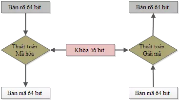

# SYMMETRIC CRYPTOGRAPHY
## DES (Data Encryption Standard)
### Khái niệm 
 - DES(Data Encryption Standard)  là thuật toán mã hóa theo khối, nó xử lý từng khối thông tin của bản rõ có độ dài xác định là 64 bit. Trước khi đi vào 16 chu trình chính, khối dữ liệu cần bảo mật sẽ được tách ra thành từng khối 64 bit, và từng khối 64 bit này sẽ lần lượt được đưa vào 16 vòng mã hóa DES để thực hiện. Tiền thân của nó là Lucifer, một thuật toán do IBM phát triển. Cuối năm 1976, DES được chọn làm chuẩn mã hóa dữ liệu của nước Mỹ, sau đó được sử dụng rộng rãi trên toàn thế giới. DES cùng với mã hóa bất đối xứng đã mở ra một thời kỳ mới trong ngành mã hóa thông tin. Trước DES, viện nghiên cứu và sử dụng mã hóa dữ liệu chỉ giới hạn trong chính phủ và quân đội.



 - Đầu vào của DES là khối 64 bit, đầu ra cũng là khối 64 bit. Khóa mã hóa có độ dài 56 bit, nhưng thực chất ban đầu là 64 bit, được lấy đi các bit ở vị trí chia hết cho 8 dùng để kiểm tra tính chẵn lẻ.
### Cơ chế hoạt động
 


##### Thuật toán sinh khóa con
 - Sơ đồ tổng quát:


 - Thực hiện hoán vị


     - $PC1K = PC1(K)$
     - Gọi $C_0$ là nửa trái của PC1K
     - Gọi $D_0$ là nửa phải của PC1K
     - Sau khi thực hiện $PC1$ như hình ảnh trên và bỏ các bit kiểm tra ``8, 16, 24, 32, 40, 48, 56, 64`` thì PC1K có độ dài 56 bit
 - Tính các giá trị dịch vòng $C_i, D_i$


     - $C_i = RotleftShift(C_{i-1}, S_i)$
     - $D_i = RotleftShift(D_{i-1}, S_i)$
     - Chúng ta có thể nhìn bảng trên để dễ hình dung.
 - Thực hiện hoán vị $PC2$ và gán khóa con $K_i$


     - $K_i = PC2(C_iD_i)$
     - Sau khi thực hiện hoán vị $PC2$ khóa $K_i$ có độ dài 48 bit
#### Quá trình mã hóa DES
##### Giai đoạn 1
 - Plaintext 64bit được đưa vào $IP$ , 1 chuỗi $C$ sẽ được tạo ra bằng cách thực hoán vị các bit của plaintext theo hoán vị $IP$ 


 - Tiếp theo $C$ sẽ được chia làm 2 phần $L_0$ (32 bit đầu) và $R_0$ ( 32 bit cuối)
   $$C \ = \ IP (plaintext) = L_0R_0$$
##### Giai đoạn 2


 - Lấy $R_0$ đi qua hàm  Feistel, Với giá trị đầu vào $R_{i-1}$ (32 bit), $K_i$ (48 bit)
 - $R_{i-1}$ khi đi qua hoán vị $E$ sẽ tăng độ dài từ 32 -> 48 bit để cùng độ dài và thực hiện XOR với $K_i$


 - Tính $E(R_i)$ ⊕ $K_i$
 - Tách kết quả của phép tính trên thành 8 khối, mỗi khối 6 bit và đưa lần lượt vào bảng $S-box$ : S1, S2, S3, S4, ..., S8.
  


 -  Với mỗi $S-box$ sẽ có 6bit đầu vào và 4 bit đầu ra
 - Kết quả từ 8 khối 6bit sẽ cho ra 8 khối 4 bit $C_i$
  - Mỗi 4 bit đầu ra của các  $S-box$ sẽ được ghép lại, theo thứ tự các và được đem vào  $P-box$.


 - $R_i = F(R_{i-1}, K_i)$ ⊕ $L_{i-1}$ $(0 < i < 17)$
 - $L_i = R_{i-1}$
##### Giai đoạn 3 
 - Áp dụng hoán vị kết thúc FP cho $R_{16}L_{16}$ ta thu được bản mã $$C \ = \ FP(R_{16}L_{16})$$


 - Quá trình giải mã của DES cũng tương tự quá trình mã hóa. Chỉ khác nhau ở: ``Li = Ri-1``. ``Ri = Li-1 ⊕  f(Ri-1, K16-i+1)``. Như vậy khóa K của hàm F sẽ đi từ khóa K16 -> K1.
##### Hàm Feistel(F)


 - Đầu vào hàm f có 2 biến:

     - Biến thứ nhất: Ri-1 là xâu bit có độ dài 32 bit. - Biến thứ hai: Ki là xâu bit có độ dài 48 bit. Đầu ra của hàm f là xâu có độ dài 32 bit. Quy trình hoạt động của hàm f như sau:
     - Biến thứ nhất Ri-1 được mở rộng thành một xâu có độ dài 48 bit theo một hàm mở rộng hoán vị E (Expansion permutation). Thực chất hàm mở rộng E(Ri-1) là một hoán vị có lặp trong đó lặp lại 16 bit của Ri-1.
     - Tính $E\text{}$($R_i \text{}$-1) ⊕  $K_i \text{}$.
     - Tách kết quả của phép tính trên thành 8 xâu 6 bit B1, B2, …, B8.
     - Đưa các khối 8 bit Bi vào 8 bảng S1, S2, …, S8 (được gọi là các hộp S-box). Mỗi hộp S-Box là một bảng 4*16 cố định có các cột từ 0 đến 15 và các hàng từ 0 đến 3. Với mỗi xâu 6 bit Bi = b1b2b3b4b5b6 ta tính được Si(Bi) như sau: hai bit b1b6 xác định hàng r trong hộp Si, bốn bit b2b3b4b5 xác định cột c trong hộp Si. Khi đó, Si(Bi) sẽ xác định phần tử Ci = Si(r,c), phần tử này viết dưới dạng nhị phân 4 bit. Như vậy, 8 khối 6 bit Bi (1 ≤ i ≤ 8) sẽ cho ra 8 khối 4 bit Ci với (1 ≤ i ≤ 8).
     - Xâu bit C = C1C2C3C4C5C6C7C8 có độ dài 32 bit được hoán vị theo phép toán hoán vị P (P-Box). Kết quả P(C ) sẽ là kết quá của hàm f(Ri-1,Ki).

 - Với sự phát triển của khoa hoạc kỹ thuật, DES không được xem là an toàn do độ dài 56 bít của khóa là quá nhỏ, nhiều kết quả nghiên cứu, phân tích cho thấy việc mã hóa có thể bị phá khóa, thuật toán 3DES  có tính an toàn cao hơn và được sử dụng trong thực tế nhiều hơn. Năm 2002 tiêu chuẩn mã hóa tiên tiến AES (Advanced Encryption Standard) được đề xuất thay thế cho tiêu chuẩn DES và 3DES, song vẫn có nhiều lĩnh vực áp dụng sử dụng DES, 3DES sau này.
- Có nhiều khóa được xem là khóa yếu trong thuật toán DES, đó là các khóa dễ có khả năng bị đối tượng phá khóa do một số bits của khóa lặp lại và dễ dự đoán trước. Việc sử dụng khóa yếu có thể làm giảm tính bảo mật của DES, do đó tránh sử dụng các khóa yếu này. Cụ thể là:
```
01010101  01010101

FEFEFEFE  FEFEFEFE 

E0E0E0E0  F1F1F1F1 

1F1F1F1F  0E0E0E0E
```
## Triple DES
 - Thuật toán 3DES sử dụng một nhóm khóa bao gồm 03 khóa DES là K1, K2 và K3, mỗi khóa có giá trị 56 bít. Thuật toán mã hóa thực hiện như sau:


##### Quá trình mã hóa
     
 - $$Ciphertext = E_{K3}(D_{K2}(E_{K1}(Plaintext)) $$
 
 - Trước tiên, thực hiện mã hóa DES với khóa K1, tiếp tục giải mã DES với khóa K2 và cuối cùng mã hóa DES với khóa K3 (E – Encryption: quá trình mã hóa; D - Decryption: quá trình giải mã; Bản rõ: Dữ liệu đầu vào của phép mã hóa hoặc dữ liệu đầu ra của phép giải mã; Bản mã: Dữ liệu đầu ra của phép mã hóa hoặc dữ liệu đầu vào của phép giải mã).
##### Quá trình giải mã


        $$Plaintext = D_{K1}(E_{K2}(D_{K3}(Ciphertext))) $$

- Quá trình giải mã với việc  giải mã với khóa K3, sau đó mã hóa với khóa K2, và cuối cùng giải mã với khóa K1..

 - 3DES mã hóa một khối dữ liệu có giá trị 64 bít (bản rõ) thành một khối dữ liệu mới có giá trị 64 bít (bản mã). Các tiêu chuẩn chỉ ra phương thức lựa chọn nhóm khóa (K1, K2, K3) như sau:

 - Với K1, K2, K3 là các khóa độc lập. Là phương thức mã hóa mạnh nhất với 168 bit khóa độc lập (168=3x56)

 - Với K1, K2 là hai khóa độc lập và  K3 = K1. Ít bảo mật hơn với 112 bít khóa ( 2x56=112 bit)

 - Với K1=K2=K3. Chỉ tương đương với việc mã hóa DES 1 lần với 56 bít khóa

 - Mỗi khóa DES thông thường được lưu trữ và truyền đi trong 8 byte, vì vậy một nhóm khóa yêu cầu 8 hoặc 16, 24 byte cho việc lưu trữ khóa.

##### Ưu và nhược điểm của 3DES

- Ưu điểm: Khác với DES, thuật toán mã hoá 3DES được mã hoá 3 lần DES với kích cỡ không gian khoá 168 bit cho nên an toàn hơn rất nhiều so với DES.

- Nhược điểm: Vì 3DES sử dụng 3 lần mã hoá DES cho nên tốc độ mã hoá sẽ chậm hơn rất nhiều so với DES. Phần mềm ứng dụng tỏ ra rất chậm đối với hình ảnh số và một số ứng dụng dữ liệu tốc độ cao vì kích thước khối 64 bit vẫn còn là một nhược điểm đối với những hệ có tốc độ của thế kỷ 21.
##### Khóa yếu
 - Một số cặp khóa yếu nên tránh sử dụng:
```
011F011F010E010E 1F011F010E010E01

01E001E001F101F1 E001E001F101F101

01FE01FE01FE01FE FE01FE01FE01FE01

1FE01FE00EF10EF1 E01FE01FF10EF10E

1FFE1FFE0EFE0EFE FE1FFE1FFE0EFE0E
```

 - Ngoài ra còn có 48 khóa được coi là “có thể yếu” nên hạn chế sử dụng:

```
01011F1F01010E0E 1F1F01010E0E0101 E0E01F1FF1F10E0E

0101E0E00101F1F1 1F1FE0E00E0EF1F1 E0E0FEFEF1F1FEFE

0101FEFE0101FEFE 1F1FFEFE0E0EFEFE E0FE011FF1FE010E

011F1F01010E0E01 1FE001FE0EF101FE E0FE1F01F1FE0E01

011FE0FE010EF1FE 1FE0E01F0EF1F10E E0FEFEE0F1FEFEF1

011FFEE0010EFEF1 1FE0FE010EF1FE01 FE0101FEFE0101FE

01E01FFE01F10EFE 1FFE01E00EFE01F1 FE011FE0FE010EF1

FE01E01FFE01F10E 1FFEE0010EFEF101 FE1F01E0FE0E01F1

01E0E00101F1F101 1FFEFE1F0EFEFE0E FE1FE001FE0EF101

01E0FE1F01F1FE0E E00101E0F10101F1 FE1F1FFEFE0E0EFE

01FE1FE001FE0EF1 E0011FFEF1010EFE FEE0011FFEF1010E

01FEE01F01FEF10E E001FE1FF101FE0E FEE01F01FEF10E01

01FEFE0101FEFE01 E01F01FEF10E01FE FEE0E0FEFEF1F1FE

1F01011F0E01010E E01F1FE0F10E0EF1 FEFE0101FEFE0101

1F01E0FE0E01F1FE E01FFE01F10EFE01 FEFE1F1FFEFE0E0E

1F01FEE00E01FEF1 E0E00101F1F10101 FEFEE0E0FEFEF1F1
```
#### Kết luận
 - Hiện nay, với nhu cầu bảo mật thông tin, đặc biệt là bảo mật thông tin truyền trên mạng internet, việc úng dụng các thuật toán mật mã nói chung hay cụ thể là sử dụng các sản phẩm mật mã trong các lĩnh vực dân sự, an ninh quốc phòng và vô cùng cần thiết. Thuật toán DES với độ dài khóa 56 bít đã không còn an toàn, tuy nhiên thuật toán 3DES vẫn đang được sử dụng trong nhiều  sản phẩm mật mã dân sự. Bài viết tổng hợp các khuyến nghị để ứng dụng an toàn thuật toán 3DES trong bảo vệ bí mật, an ninh, thông tin. Người sử dụng cần kết hợp giữa các nhu cầu về bảo mật, yêu cầu hệ thống và các khuyến nghị trong phần 3 để đảm bảo an toàn, bí mật thông tin khi sử dụng thuật toán 3DES.
## AES (Advanced Encryption Standard)
### Khái niệm
 -- AES (Advanced Encryption Standard) là một thuật toán mã hóa đối xứng được sử dụng để bảo vệ dữ liệu trong các hệ thống máy tính và mạng. AES là một chuẩn mã hóa được công bố bởi Viện Tiêu chuẩn và Công nghệ Quốc gia Hoa Kỳ (NIST) vào năm 2001, thay thế cho chuẩn mã hóa DES (Data Encryption Standard) cũ.
 -- Thuật toán AES sử dụng cùng một khóa cho việc mã hóa và giải mã dữ liệu, là một dạng mã hóa đối xứng. AES hoạt động trên các khối dữ liệu có kích thước cố định (128 bit) và có thể sử dụng các khóa với độ dài khác nhau (128, 192 hoặc 256 bit) để tăng cường tính bảo mật.
 ### Đặc điểm
 - Có ba độ dài của khóa mã hóa AES:
     - Độ dài khóa 128 bit
     - Độ dài khóa 192 bit
     - Độ dài khóa 256 bit
 - Mặc dù độ dài khóa của phương pháp mã hóa này khác nhau, kích thước khối của nó - 128 bit (hoặc 16 byte) - vẫn cố định.
 - AES sử dụng cấu trúc block cipher, có nghĩa là nó mã hóa dữ liệu theo các khối cố định có kích thước 128 bit.
 - AES sử dụng các vòng lặp mã hóa, mỗi vòng lặp được thực hiện trên một khối 128 bit của dữ liệu.
 -  AES là một thuật toán mã hóa đối xứng, có nghĩa là nó sử dụng cùng một khóa để mã hóa và giải mã dữ liệu
 -  Vòng lặp chính của AES thực hiện các hàm:
     -  SubBytes 
     -  ShiftRows 
     -  MixColumns 
     -  AddRoundKey 
#### Xây dựng bảng $S-box$
 - Bảng $S-box$ thuận được sinh ra bằng việc xác định nghịch đảo cho mọt giá trị nhất định trên trường $GF(2^8) = GF(2)[x]/(x^8+x^4+x^3+x+1)$.Những nghịch đảo được chuyển đôi thông qua phép biến đổi affine.


 - $S-box$ nghịch đảo chỉ đơn giản là $S-box$ chạy ngược. Nó được tính bằng phép biến đổi affine nghịch đảo các giá trị đầu vào. Phép biến đổi affine nghịch đảo được biểu diễn như sau:


#### Thuật toán sinh khóa
 - Quá trình sinh khóa gồm 4 bước:
     - Rotword : quay trái 8 bit
     - SubBytes
     - Rcon: tính giá trị Rcon(i): $Rcon(i) = x(i-1) mod (x^8+x^4+x^3+x+1)$
     - ShiftRow:
   


 ### Cơ chế hoạt động


##### SubBytes 


 - Từng phần tử của ma trận state được thay thế bằng giá trị tra cứu trong bảng S-BOX
##### ShiftRows 


 - Các hàng của ma trận state được dịch chuyển theo chu kỳ.
 - Hàng đầu tiên giữ nguyên
 - Hàng thứ hai dịch trái 1 byte
 - Hàng thứ ba dịch trái 2 byte
 - Hàng cuối cùng dịch trái 3 byte
##### MixColumns


 - Phép biến đổi MixColumns thực hiện biến đổi độc lập từng cột trong ma trận state bằng một phép nhân đa thức. Mỗi cột của state đươc coi là biểu diễn của một đa thức $f(x)\text{}$ trong $GF(2^8)\text{}$ như vậy phép biến đổi MixColumns chính là phép nhân theo modulo với $x^4+1\text{}$ với một đa thức cố định định nghĩa như sau: $$c(x) \ = \ 3x^{3} \ + \ x^{2} \ + \ x \ + \ 2 \ (modulo  \ x^{4} \ + \ 1 \ ) $$


 - Phép nhân đa thức trên có thể biểu diễn dưới dạng phép nhân ma trận như sau


 - [Rijndael MixColumns](https://en.wikipedia.org/wiki/Rijndael_MixColumns)
 - Ví dụ về phép MixColumns


##### AddRoundKey


 - Trong thao tác AddRoundKey, 128 bit của ma trận state sẽ được XOR với 128 bit của khóa con của từng vòng. Vì sử dụng phép XOR nên phép biến đổi ngược của AddRoundKey trong cấu trúc giải mã cũng chính là AddRoundKey. Việc kết hợp với khóa bí mật tạo ra tính làm rối (confusion) của mã hóa. Sự phức tạp của thao tác mở rộng khóa (KeySchedule) giúp gia tăng tính làm rối này
#### Tóm tắt hoạt động
##### 1.Key expansion: 
 - Thuật toán AES lấy khóa mã hóa và mở rộng nó thành một tập hợp các round key, một khóa cho mỗi vòng của quy trình mã hóa.
##### 2.Initial round:
 - Thuật toán thực hiện một vòng thao tác đầu tiên theo thứ tự bao gồm
     - AddRoundKey: round key đầu tiên được XOR với plaintext(bản rõ).
     - Thực hiện 1 vòng đầu tiên gồm:SubBytes, ShiftRows, MixColumns, AddRound Key
##### 3. Round
 - Thực hiện một vòng lặp, phụ thuốc vào kích thước khóa
     - AES-128 - 10 vòng lặp
     - AES-192 - 12 vòng lặp
     - AES-256 - 14 vòng lặp
 - Từ vòng 1 đến vòng N - 1 thực hiên 
     - SubBytess
     - ShiftRows
     - MixColumns
     - AddRoundKey
 - Ở vòng cuối cùng thì không có bước MixColums
     - SubBytess
     - ShiftRows
     - AddRoundKey
##### 4. Output
 - Bản mã 128/192/256-bit kết quả là đầu ra của quá trình mã hóa.
##### Kết luận
 - AES là một trong những thuật toán mã hóa đối xứng phổ biến nhất hiện nay. Nó có nhiều ưu điểm, bao gồm tính bảo mật cao, tốc độ xử lý nhanh, khả năng sử dụng trên nhiều nền tảng và hỗ trợ cho các khóa có độ dài lên đến 256 bit. Tuy nhiên, nhược điểm của AES là nó có thể bị tấn công bằng các phương pháp như tấn công dựa trên khóa và tấn công bằng phương pháp phân tích dữ liệu. Để đảm bảo an toàn cho hệ thống mã hóa, các chuyên gia bảo mật khuyên nên sử dụng các phiên bản AES mới nhất và sử dụng các phương pháp mã hóa hiện đại nhất để tăng cường tính bảo mật.
 - Thiết kế và độ dài khóa của thuật toán AES ( 128, 192 và 256 bit ) là đủ an toàn để bảo vệ các thông tin được xếp vào loại tối mật nhưng về an ninh của AES thì các nhà khoa học đánh giá là chưa cao. Nếu các kỹ thuật tấn công được cải thiện thì AES có thể bị phá vỡ.
 - Một vấn đề khác nữa là cấu trúc toán học của AES khá đơn giản
## Block cipher modes of Operation
### ECB (Electronic codebook)
 - AES ECB (Advanced Encryption Standard Electronic Codebook) là một chế độ hoạt động của thuật toán mã hóa AES (Advanced Encryption Standard). Đây là chế độ đơn giản nhất và dễ hiểu nhất trong các chế độ mã hóa của AES.
 - Mã hóa ECB: Plaintext là đầu vào trực tiếp để thực thi thuật toán mã hóa với khóa mã K để tạo ra ciphertext.
 - Giải mã ECB: Ciphertext là đầu vào trực tiếp để thực thi thuật toán giải mã với khóa mã K để tạo ra plaintext.
 - Ưu điểm của ECB:

     - ECB là một trong những chế độ mã hóa đơn giản nhất để hiện thực. Quá trình mã hóa và giải mã đơn giản, chỉ đơn giản là áp dụng thuật toán mã hóa lên từng khối dữ liệu.
     - Dễ dàng xử lý song song: Vì mỗi khối dữ liệu được mã hóa độc lập, việc xử lý song song trên các khối có thể được thực hiện dễ dàng. Điều này có thể đem lại tốc độ mã hóa và giải mã nhanh hơn trong một số trường hợp.
 - Nhược điểm của ECB:

     - Thiếu bảo mật: ECB không cung cấp tính bảo mật cao.
     - Không đảm bảo tính toàn vẹn
     - Không hỗ trợ xử lý dữ liệu lớn
 - Dưới đây là mô hình mã hóa và giải mã AES-ECB:


 - Code minh họa:
```python3
from Crypto.Cipher import AES
from Crypto.Util.Padding import*
import os

def encrypt_ecb(plaintext):
    cipher = AES.new(key, AES.MODE_ECB)
    ciphertext = cipher.encrypt(plaintext)
    return ciphertext

def decrypt_ecb(ciphertext):
    cipher = AES.new(key, AES.MODE_ECB)
    plaintext = cipher.decrypt(ciphertext)
    return unpad(plaintext, AES.block_size)

key = os.urandom(16)
text = b'KCSC{AES_mode_ECB!?!}'
plaintext = pad(text, AES.block_size)

ciphertext = encrypt_ecb(plaintext)
decrypt = decrypt_ecb(ciphertext)


print(f"{ciphertext = }")
print(f"{decrypt = }")
```
### CBC (Cipher block chaining)
 - AES CBC (Advanced Encryption Standard Cipher Block Chaining) là một chế độ hoạt động của thuật toán mã hóa AES (Advanced Encryption Standard). Đây là một trong những chế độ mã hóa phổ biến và được sử dụng rộng rãi trong các hệ thống bảo mật. Là chế độ mã hóa chuỗi, kết quả mã hóa của khối dữ liệu trước (ciphertext) sẽ được tổ hợp với khối dữ liệu kế tiếp (plaintext) trước khi thực thi mã hóa.
 - Mã hóa CBC:
    $$C_i = E_K(P_i ⊕ C_{i-1})$$
    $$C_0 = IV $$
     - Lần mã hóa đầu tiên:
         - Plaintext XOR với vector khởi tạo IV
         - Kết quả bước trên là đầu vào cho việc thực thi thuật toán mã hóa với khóa mã K
     - Lần mã hóa sau lần đầu tiên:
         - Plaintext XOR với ciphertext của lần mã hóa trước đó.
         - Kết quả bước trên là đầu vào cho việc thực thi thuật toán mã hóa với khóa mã K
 - Giải mã CBC:
    $$P_i = D_K(C_i)⊕C_{i-1} $$
    $$C_0 = IV $$
     - Lần giải mã đầu tiên:
         - Ciphertext được thực thi quá trình giải mã với khóa mã K
         - Kết quả bước trên được XOR với vector khởi tạo IV để tạo ra plaintext
     - Lần giải mã sau lần đầu tiên:
         - Ciphertext được thực thi quá trình giải mã với khóa mã K
         - Kết quả bước trên được XOR với ciphertext sử dụng trong lần giải mã trước để tạo ra plaintext
 - Ưu điểm của CBC:
     - Khả năng bảo mật cao hơn ECB.
     - Quá trình giải mã (mã hóa nghịch) vẫn có thể thực hiện song song nhiều khối dữ liệu.
 - Nhược điểm:

     - Thiết kế phần cứng phức tạp hơn ECB
     - Lỗi bit bị lan truyền. Nếu một lỗi bit xuất hiện trên ciphertext của một khối dữ liệu thì nó sẽ làm sai kết quả giải mã của khối đữ liệu đó và khối dữ liệu tiếp theo.
     - Không thể thực thi quá trình mã hóa song song vì xử lý của khối dữ liệu sau phụ thuộc vào ciphertext của khối dữ liệu trước, trừ lần mã hóa đầu tiên.
 - Dưới đây là mô hình mã hóa và giải mã AES-CBC


 - Code minh họa:
```python3
from Crypto.Cipher import AES
from Crypto.Util.Padding import*
import os

def encrypt_cbc(plaintext):
    cipher = AES.new(key, AES.MODE_CBC, iv)
    ciphertext = cipher.encrypt(plaintext)
    return ciphertext

def decrypt_cbc(ciphertext):
    cipher = AES.new(key, AES.MODE_CBC, iv)
    plaintext = cipher.decrypt(ciphertext)
    return unpad(plaintext, AES.block_size)

iv = os.urandom(16)
key = os.urandom(16)
text = b'KCSC{AES_mode_CBC!!!}'
plaintext = pad(text, AES.block_size)


ciphertext = encrypt_cbc(plaintext)
decrypt = decrypt_cbc(ciphertext)

print(f"{ciphertext = }")
print(f"{decrypt = }")
```
### PCBC (Propagating Cipher block chaining)
 - AES PCBC (Advanced Encryption Standard Propagating Cipher Block Chaining) là một chế độ hoạt động khác của thuật toán mã hóa AES (Advanced Encryption Standard). PCBC là một biến thể của chế độ CBC và thêm vào một bước thay đổi (propagation) để tăng tính ngẫu nhiên và đảm bảo tính toàn vẹn của dữ liệu.
 - Mã hóa PCBC
     $$C_i = E_K(P_i⊕P_{i-1}⊕C_{i-1}, ), \ P_0 ⊕ C_0 = IV$$
 - Giải mã PCBC
     $$P_i = D_K(C_i)⊕P_{i-1}⊕C_{i-1}, \ P_0 ⊕ C_0 = IV $$
 - Dưới đây là mô hình mã hóa và giải mã AES-PCBC


### CFB (Cipher feedback)
 - AES CFB (Advanced Encryption Standard Cipher Feedback) là một chế độ hoạt động của thuật toán mã hóa AES (Advanced Encryption Standard). Đây là chế độ mã hóa mà ciphertext của lần mã hóa hiện tại sẽ được phản hồi (feedback) đến đầu vào của lần mã hóa tiếp theo. Nghĩa là, ciphertext của lần mã hóa hiện tại sẽ được sử dụng để tính toán ciphertext của lần mã hóa kế tiếp. Mô tả có vẻ giống CBC nhưng quá trình trực hiện lại khác.
 - Mã hóa CFB:
 


    - Lần mã hóa đầu tiên:
       - Khối dữ liệu ngõ vào của quá trình mã hóa lấy từ IV.
       - Vector khởi tạo IV được mã hóa để tạo ra một khối giá trị chứa b bit.
       - s bit MSB của kết quả trên sẽ được dùng để XOR với s bit dữ liệu (plaintext) để tạo ra s bit ciphertext.
    - Lần mã hóa sau lần đầu tiên:
       - Khối dữ liệu ngõ vào của quá trình mã hóa được ghép giã b-s bit LSB của khối ngõ vào của lần mã hóa trước đó và s bit của ciphertext của lần mã hóa trước đó.
       - Giá trị của bước trên được mã hóa để tạo ra một khối giá trị chứa b bit.
       - s bit MSB của kết quả trên sẽ được dùng để XOR với s bit dữ liệu (plaintext) để tạo ra s bit ciphertext.
 - Giải mã CFB:
    $$P_i = {E_K(C_{i-1})⊕C_i} $$
 - Ưu điểm:
    - Khả năng bảo mật cao hơn ECB
    - Quá trình giải mã (mã hóa nghịch) vẫn có thể thực hiện song song nhiều khối dữ liệu.
    - Tùy biến được độ dài khối dữ liệu mã hóa, giải mã thông qua thông số s
 - Nhược điểm:
    - Thiết kế phần cứng phức tạp hơn CBC
    - Lỗi bit bị lan truyền. Nếu một lỗi bit xuất hiện trên ciphertext của một khối dữ liệu thì nó sẽ làm sai kết quả giải mã của khối đữ liệu đó và khối dữ liệu tiếp theo.
    - Không thể thực thi quá trình mã hóa song song vì xử lý của khối dữ liệu sau phụ thuộc vào ciphertext của khối dữ liệu trước, trừ lần mã hóa đầu tiên
 - Dưới đây là mô hình mã hóa và giải mã AES-CFB


 - Code minh họa:
```python3
from Crypto.Cipher import AES
from Crypto.Util.Padding import*
import os

def encrypt_cfb(plaintext):
    cipher = AES.new(key, AES.MODE_CFB, iv)
    ciphertext = cipher.encrypt(plaintext)
    return ciphertext

def decrypt_cfb(ciphertext):
    cipher = AES.new(key, AES.MODE_CFB, iv)
    plaintext = cipher.decrypt(ciphertext)
    return unpad(plaintext, AES.block_size)

iv = os.urandom(16)
key = os.urandom(16)
text = b'KCSC{AES_mode_CFB!!!}'
plaintext = pad(text, AES.block_size)


ciphertext = encrypt_cfb(plaintext)
decrypt = decrypt_cfb(ciphertext)

print(f"{ciphertext = }")
print(f"{decrypt = }")
```
### OFB (Output feedback)
 - AES OFB (Advanced Encryption Standard Output Feedback) là một chế độ hoạt động của thuật toán mã hóa AES (Advanced Encryption Standard). Là một thuật toán mã hóa đối xứng được sử dụng rộng rãi để bảo vệ thông tin. Đây là chế độ mã hóa mà giá trị ngõ ra của khối thực thi thuật toán mã hóa, không phải ciphertext, của lần mã hóa hiện tại sẽ được phản hồi (feedback) đến ngõ vào của lần mã hóa kế tiếp.
 - Do tính đối xứng của xor nên việc mã hóa và giải mã hoàn toàn giống nhau:
 $C_j = P_j ⊕ M_J\text{}$
 $P_j = C_j ⊕ O_j\text{}$
 $O_j = E_K(I_j)\text{}$
 $I_j = O_{j-1}$
 $I_0 = IV$
 - Mã hóa OFB:
   - Lần mã hóa đầu tiên:
      - Giá trị IV được lấy làm khối giá trị đầu vào mã hóa.
      - Thực thi giải thuật mã hóa cho khối trên với khóa mã K.
      - XOR plaintext và kết quả của bước trên.
   - Lần mã hóa sau lần đầu tiên và trước lần cuối cùng:
      - Giá trị của khối ngõ ra (output block) trước đó được lấy làm khối giá trị đầu vào mã hóa.
      - Thực thi giải thuật mã hóa cho khối trên với khóa mã K.
      - XOR plaintext và kết quả của bước trên.
   - Lần mã hóa cuối cùng:
      - Giá trị của khối ngõ ra (output block) trước đó được lấy làm khối giá trị đầu vào mã hó.
      - Thực thi giải thuật mã hóa cho khối trên với khóa mã K.
      - XOR plaintext và với các bit MSB của kết quả của bước trên theo độ dài của plaintext.
 - Giải mã OFB:
   - Lần giải mã đầu tiên:
      - Giá trị IV được lấy làm khối giá trị đầu vào mã hóa.
      - Thực thi giải thuật mã hóa cho khối trên với khóa mã K.
      - XOR ciphertext và kết quả của bước trên.
   - Lần giải mã sau lần đầu tiên và trước lần cuối cùng:
      - Giá trị của khối ngõ ra (output block) trước đó được lấy làm khối giá trị đầu vào mã hóa.
      - Thực thi giải thuật mã hóa cho khối trên với khóa mã K.
      - XOR ciphertext và kết quả của bước trên.
   - Lần giải mã cuối cùng (thứ n):
      - Giá trị của khối ngõ ra (output block) trước đó được lấy làm khối giá trị đầu vào mã hóa.
      - Thực thi giải thuật mã hóa cho khối trên với khóa mã K.
      - XOR ciphertext và với các bit MSB của kết quả của bước trên theo độ dài của ciphertext.
 - Ưu điểm:
    - Khả năng bảo mật cao hơn ECB. Ciphertext của một khối dữ liệu plaintext có thể khác nhau cho mỗi lần mã hóa vì nó phụ thuộc vào IV hoặc khối ngõ ra của lần mã hóa trước đó.
    - Lỗi bit không bị lan truyền. Khi một lỗi bit xuất hiện trên một ciphertext, nó chỉ ảnh hưởng đến kết quả giải mã của khối dữ liệu hiện tại
    - Thiết kế phần cứng đơn giản hơn CFB.
 - Nhược điểm:
    - Không thể thực hiện mã hóa/giải mã song song nhiều khối dữ liệu vì lần mã hóa/giải mã sau phụ thuộc vào khối ngõ ra của lần mã hóa/giải mã liền trước nó.
 - Dưới đây là mô hình mã hóa và giải mã AES-OFB


 - Code minh họa:
```python3
from Crypto.Cipher import AES
from Crypto.Util.Padding import*
import os

def encrypt_ofb(plaintext):
    cipher = AES.new(key, AES.MODE_OFB, iv)
    ciphertext = cipher.encrypt(plaintext)
    return ciphertext

def decrypt_ofb(ciphertext):
    cipher = AES.new(key, AES.MODE_OFB, iv)
    plaintext = cipher.decrypt(ciphertext)
    return unpad(plaintext, AES.block_size)

iv = os.urandom(16)
key = os.urandom(16)
text = b'KCSC{AES_mode_OFB!!!}'
plaintext = pad(text, AES.block_size)


ciphertext = encrypt_ofb(plaintext)
decrypt = decrypt_ofb(ciphertext)

print(f"{ciphertext = }")
print(f"{decrypt = }")
```
### CTR (Counter)
 - AES-CTR (Advanced Encryption Standard - Counter Mode) là một chế độ hoạt động của thuật toán AES (Advanced Encryption Standard) được sử dụng để mã hóa thông tin. Đây là chế độ mã hóa sử dụng một tập các khối ngõ vào, gọi là các counter, để sinh ra một tập các giá trị ngõ ra thông qua một thuật toán mã hóa. Sau đó, giá trị ngõ ra sẽ được XOR với plaintext để tạo ra ciphertext trong quá trình mã hóa, hoặc XOR với ciphertext để tạo ra plaintext trong quá trình giải mã.
 - Mã hóa CTR:
    - Giá trị của khối ngõ ra (output block) được tạo từ giá trị của khối bộ đếm thứ j bằng cách thực thi giải thuật mã hóa với khóa K.
    - Giá trị trên được XOR với plaintext thứ j để tạo ra ciphertext thứ j.
    - Đối với khối dữ liệu cuối cùng của chuỗi dữ liệu, khối thứ n, nếu độ dài bit của plaintext ít hơn độ dài bit được quy định bởi chuẩn mã hóa thì chỉ lấy các bit trọng số cao của khối ngõ ra (output block) XOR với plaintext.
 - Giải mã CTR:
    - Giá trị của khối ngõ ra (output block) được tạo từ giá trị của khối bộ đếm thứ j bằng cách thực thi giải thuật mã hóa với khóa K.
    - Giá trị trên được XOR với ciphertext thứ j để tạo ra plaintext thứ j.
    - Đối với khối dữ liệu cuối cùng của chuỗi dữ liệu, khối thứ n, nếu độ dài bit của ciphertext ít hơn độ dài bit được quy định bởi chuẩn mã hóa thì chỉ lấy các bit trọng số cao của khối ngõ ra (output block) XOR với ciphertext.

 - Ưu điểm:
    - Khả năng bảo mật cao hơn ECB. Tuy quá trình mã hóa/giải mã của mỗi khối dữ liệu là độc lập nhưng mỗi plaintext có thể ảnh xạ đến nhiều ciphertext tùy vào giá trị bộ đếm của các lần mã hóa. 
    - Có thể mã hóa/giải mã song song nhiều khối dữ liệu.
 - Nhược điểm: Phần cứng cần thiết kế thêm các bộ đếm counter hoặc giải thuật tạo các giá trị counter không lặp lại. 
 - Dưới đây là mô hình mã hóa và giải mã AES-CTR


 - Code minh họa
```python3
from Crypto.Cipher import AES
from Crypto.Util import*
import secrets, os

def encrypt_ctr(plaintext):
    counter = Counter.new(128, initial_value=int.from_bytes(nonce, byteorder='big'))
    cipher = AES.new(key, AES.MODE_CTR, counter=counter)
    ciphertext = cipher.encrypt(plaintext)
    return ciphertext

def decrypt_ctr(ciphertext):
    counter = Counter.new(128, initial_value=int.from_bytes(nonce, byteorder='big'))
    cipher = AES.new(key, AES.MODE_CTR, counter=counter)
    plaintext = cipher.decrypt(ciphertext)
    return plaintext
 
nonce = secrets.token_bytes(8)
key = os.urandom(16)
plaintext = b'KCSC{AES_mode_CTR!!!!}'

ciphertext = encrypt_ctr(plaintext)
decrypt = decrypt_ctr(ciphertext)

print(f"{ciphertext = }")
print(f"{decrypt = }")
```

### GCM (Galois/Counter Mode)
 - AES-GCM (Advanced Encryption Standard - Galois/Counter Mode) là một thuật toán mã hóa đối xứng được sử dụng để bảo vệ tính toàn vẹn và bảo mật dữ liệu trong giao tiếp trực tuyến, bao gồm các ứng dụng như TLS (Transport Layer Security) và VPN (Virtual Private Network). AES là thuật toán mã hóa đối xứng được sử dụng để mã hóa dữ liệu, trong khi GCM là một chế độ hoạt động (mode of operation) được sử dụng để bảo vệ tính toàn vẹn dữ liệu và xác thực nguồn gốc dữ liệu
 - Trong quá trình mã hóa, AES-GCM sử dụng một khóa đối xứng cùng với một nonce (number used once) và một bộ đếm (counter) để tạo ra một bản mã (ciphertext). Sau đó, GCM sử dụng một thủ tục kiểm tra tính toàn vẹn và xác thực nguồn gốc (authentication) để đảm bảo rằng dữ liệu không bị thay đổi hoặc tấn công trung gian trong quá trình truyền tải.


 - Hàm GHASH sử dụng trong GCM nhằm cung cấp tính xác thực cho dữ liệu 
bảo mật. Hàm GHASH được xây dựng bởi các phép nhân trong trường $GF(2^{128})$
với khóa con băm (H) theo công thức: 


$$\sum^{n}_{j=1} X_j.H^{n-j+1} = X_1.H^n \oplus X_2.H^{n-1} \oplus ... \oplus X_n.H$$


trong đó, X1 ÷ Xn là các khối đầu vào 128-bit. 
 - Mặc dù việc lựa chọn tham số q (số nhánh nhân-cộng song song) không bị giới hạn nhưng để đạt được số chu kỳ đồng hồ là nhỏ và thông lượng cao thì sử dụng $q\text{}$ = $2^j\text{}$, 1 < j < [$log_2(n)\text{}$]. Đầu ra hàm GHASH(X,H) nhận được:


 - Trong đó, tất cả các toán hạng được thực hiện trong trường GF(2128), với đa thức : 
      $$P(x) \ = \ x^{128} \ + \ x^7 \ + \ x^2 \ + \ x \ + \ 1$$
 - Với thuật toán hàm GHASH như ở (2), số chu kỳ đồng hồ cần thiết để thực hiện sẽ là $(\frac{n}{q} + log_2(q))$. Đối với $(\frac{n}{q} - 1)$chu kỳ đầu, sẽ thực hiện các phép nhân $H^q\text{}$ trong trường $GF(2^{128})\text{}$, với $log_2(q)\text{}$ chu kỳ tiếp theo sẽ thực hiện các hàm mũ khác tương ứng và chu kỳ cuối cùng là thực hiện XOR các kết quả $\sum^{n}_{j-1} X_j.H^{n-j+1}$


 - Theo (2), ta xét các trường hợp: 
     - $q = 8\text{}$ (8 nhánh nhân - cộng song song)

        $$(X_1.H^8 \oplus X_9).H^8 . 1 . 1 \oplus (X_2.H^8 \oplus X_{10}).H^4 . H^2 . H \oplus ... \oplus (X_i.H^8 \oplus X_{i+8}).H^{4a_1^{(i)}} . H^{2a_{2}^{i}} . H^{a_3^{(i)}} \oplus ... \oplus (X_8.H^8 \oplus X_{16}).H . 1 . 1$$


     trong đó (a1, a2, a3) là biểu diễn nhị phân của q - i + 1,  1 < i < 8
     - $q = 4\text{}$ (4 nhánh nhân - cộng song song)

        $$((X_1.H^4 \oplus X_5).H^4 \oplus X_9).H^2 \oplus ((X_2.H^4 \oplus X_6).H^4 \oplus X_{10}).H \oplus ((X_3.H^4 \oplus X_7).1 \oplus 0).H^4 \oplus ((X_4.H^4 \oplus X_8).H^2 \oplus 0).H$$


     - $q = 2\text{}$ (2 nhánh nhân - cộng song song)

       $$(X_1.H \oplus X_3).H^2 \oplus (X_2.H^2 \oplus X_4).H$$


## Meet in the middle Attack with 2DES
 - “Meet-in-the-middle” là một kỹ thuật tấn công được sử dụng để giảm đáng kể số lượng khóa có thể phải thử khi tấn công một hệ mã hóa. Đây là một phương pháp tấn công hiệu quả đối với các hệ mã hóa sử dụng khối mã hóa với khóa ngắn.
 - Double DES:
     - Double DES là một kỹ thuật mã hóa sử dụng hai phiên bản DES trên cùng một plaintext. Trong cả hai trường hợp, nó sử dụng các khóa khác nhau để mã hóa plaintext. Cả hai khóa đều được yêu cầu tại thời điểm giải mã.Plaintext 64 bit đi vào phiên bản DES đầu tiên, sau đó được chuyển đổi thành văn bản ở giữa 64 bit bằng khóa đầu tiên và sau đó chuyển sang phiên bản DES thứ hai cung cấp ciphertext 64 bit bằng cách sử dụng khóa thứ hai.


     - Mỗi khóa K có độ dài 56 bit, tổng lại Double DES sử dụng khóa 112 bit nhưng mức bảo mật lại là $2^{56}\text{}$ chứ không phải $2^{112}\text{}$, và dễ bị tấn công bở meet-in-the-middle.
     - Mã hóa: Cho một bản mã P và 2 key K1, K2. ciphertext C là sản phẩm của việc mã hóa: $$C = E_{K2}(E_{K1}(P)) $$
     - Giải mã:
              $$P = D_{K1}(D_{K2}(P)) $$

 - Cuộc tấn công "Meet in the middle 2DES" sử dụng kỹ thuật phân tích tương tự để giảm số lượng khóa cần phải thử xuống $2^{57}\text{}$
 - Cuộc tấn công bao gồm hai giai đoạn:
     - Giai đoạn tiền tính toán: Kẻ tấn công tạo ra một bảng chứa tất cả các tổ hợp có thể có của khóa đầu tiên và bản mã tương ứng, kết quả từ việc mã hóa bản rõ bằng khóa đầu tiên.
     - Giai đoạn tấn công: Kẻ tấn công mã hóa cùng một bản rõ với tất cả các tổ hợp có thể có của khóa thứ hai và so sánh bản mã kết quả với bảng được tạo trong giai đoạn đầu tiên. Khi tìm thấy một kết quả phù hợp, các khóa tương ứng là những khóa chính xác.
 - Quy tình:
     - Đầu tiên, attacker đoán ``K1``. Gọi dự đoán của attacker là ``K1'``.Với mỗi lần đoán attacker tính
       $$M' = E_{K1'}(P )$$
sẽ thu được 1 giá trị và lưu kết quả vào trong cùng 1 bảng với ``K1'`` tương ứng
     - Sau khi thêm vào bảng, với mỗi $2^{56}\text{}$ có thể là chìa khóa của ``K1``, attacker chuyển sang đoán ``K2``. Tính:
       $$M' = D_{K2'}(C)$$
sau đó kiểm tra ``M'`` có khớp với bất kì ``M`` nào đa lưu trong bảng lưu trữ trước đó hay không.
     - Nếu tìm thấy:
       $$E_{K1'} (P) = D_{K2'} (C)$$ thì ``K1 = K1' và K2 = K2'``
 - Bằng cách sử dụng phương pháp này, kẻ tấn công giảm không gian tìm kiếm của các khóa từ $2^{112}\text{}$ xuống $2^{56}\text{}$ + $2^{56}\text{}$ = $2^{57}\text{}$, nhanh hơn đáng kể so với tấn công vét cạn. Cuộc tấn công này còn được gọi là cuộc tấn công “double-DES”, vì nó liên quan đến việc khai thác việc sử dụng hai thao tác DES với các khóa khác nhau.
 - Minh họa
```python3
def meet_in_the_middle_2DES(C, P):
  table = {}
  for i in range(0, 2^56):
    table[E(P, i)] = i
  for i in range(0, 2^56):
    if D(C, i) in table:
      return table[D(C, i)], i
```
 - Challenge Minh họa
```python3
from Crypto.Cipher import AES
from Crypto.Util.Padding import pad
from hashlib import md5
from os import urandom

FLAG = b"KCSC{???????????????????????????}"
assert len(FLAG) % 16 == 1 # hint

key1 = md5(urandom(3)).digest()
key2 = md5(urandom(3)).digest()
cipher1 = AES.new(key1, AES.MODE_ECB)
cipher2 = AES.new(key2,AES.MODE_ECB)

enc = cipher1.encrypt(pad(FLAG,16))
enc = cipher2.encrypt(enc)

print(enc.hex())
# 21477fac54cb5a246cb1434a1e39d7b34b91e5c135cd555d678f5c01b2357adc0c6205c3a4e3a8e6fb37c927de0eec95
```
 - Với bài này được mã hóa 2 lần với key1 và key 2.Tôi sẽ áp dụng cách tấn công meet-in-the-middle ở bên trên đối với bài này để tìm ra key1, key2 và tìm ra flag.
 - Bài này key1, key2 được random 3 bytes và được băm với md5. 
 - Dựa vào hint ``assert len(FLAG) % 16 == 1 # hint`` tôi thấy block cuối sẽ bị lẻ kí tự ``}`` và padding sao cho đủ 16 byte ``pad(b"}", 16)``
 - Tiếp đó tôi sẽ brute force key1, key2 sao cho
   $$E_{K1'} (P) = D_{K2}(C) $$
với key1, key2 được random 3 bytes và được băm với md5. 
```python3
from Crypto.Util.Padding import pad, unpad
import hashlib
from Crypto.Cipher import AES
from itertools import product

def encrypt(plaintext, key):
    cipher = AES.new(key, AES.MODE_ECB)
    ciphertext = cipher.encrypt(plaintext)
    return ciphertext

def decrypt(ciphertext, key):
    cipher = AES.new(key, AES.MODE_ECB)
    plaintext = cipher.decrypt(ciphertext)
    return plaintext

def meet_in_the_middle():
    table= {}

    for i, j, k in product(range(256), repeat=3):
        key1 = hashlib.md5(bytes([i, j, k])).digest()
        table[encrypt(pltpad, key1)] = key1

    for i, j, k in product(range(256), repeat=3):
        key2 = hashlib.md5(bytes([i, j, k])).digest()
        if decrypt(last_block, key2) in table:
            key1 = table[decrypt(last_block, key2)]
            break
    return key1, key2

pltpad = pad(b"}", 16)
ciphertext = bytes.fromhex("21477fac54cb5a246cb1434a1e39d7b34b91e5c135cd555d678f5c01b2357adc0c6205c3a4e3a8e6fb37c927de0eec95")
last_block = ciphertext[32:48]

[key1, key2] = meet_in_the_middle()
flag = decrypt(decrypt(ciphertext, key2), key1)
print(flag)
```
> FLAG : KCSC{MeEt_In_tHe_mIdDLe_AttaCk__}
## Padding Oracle Attack
 - Trong symmetric cipher, cuộc tấn công oracle đệm có thể được áp dụng cho mode AES-CBC, trong đó “oracle” (thường là máy chủ) rò rỉ dữ liệu về việc liệu phần đệm của tin nhắn được mã hóa có chính xác hay không. Dữ liệu như vậy có thể cho phép những kẻ tấn công giải mã (và đôi khi mã hóa) tin nhắn thông qua oracle bằng cách sử dụng khóa của oracle mà không cần biết khóa mã hóa.
 - Việc triển khai tiêu chuẩn của giải mã CBC trong mật mã khối là giải mã tất cả các khối bản mã, xác thực phần đệm, xóa phần đệm PKCS7 và trả về plaintext của tin nhắn. Nếu máy chủ trả về lỗi “đệm không hợp lệ” thay vì lỗi chung “giải mã không thành công”, kẻ tấn công có thể sử dụng máy chủ như một oracle đệm để giải mã (và đôi khi mã hóa) message


 - Ở đây tôi tìm thấy 1 tool demo [``padding oracle tool``](https://paddingoracle.github.io/) và 1 video demo cho dễ hiểu [``padding oracle video``](https://youtu.be/uDHo-UAM6_4?si=PaJ0nMGgOQoYTKQ2)
 - Giả sử attacker có block cipher $C_1 \text{}$, $C_2 \text{}$, muốn giải mã block2 để có được $P_2 \text{}$. Khi đó attacker thay đổi byte cuối cùng của $C_1 \text{}$ (tạo $C'_1 \text{}$) và gửi (IV, $C'_1 \text{}$ , $C_2 \text{}$) đến máy chủ
 - Máy chủ sẽ trả về phần đệm cuối cùng của block được giải mã $P'_2 \text{}$.
 - Attacker biết byte cuối của
   $$D_K(C_2) ⊕ C'_1$$
 ```bash!
 '\x01'
'\x02\x02'
'\x03\x03\x03'
'\x04\x04\x04\x04'
'\x05\x05\x05\x05\x05'
'\x06\x06\x06\x06\x06\x06'
'\x07\x07\x07\x07\x07\x07\x07'
'\x08\x08\x08\x08\x08\x08\x08\x08'
'\t\t\t\t\t\t\t\t\t'
'\n\n\n\n\n\n\n\n\n\n'
'\x0b\x0b\x0b\x0b\x0b\x0b\x0b\x0b\x0b\x0b\x0b'
'\x0c\x0c\x0c\x0c\x0c\x0c\x0c\x0c\x0c\x0c\x0c\x0c'
'\r\r\r\r\r\r\r\r\r\r\r\r\r'
'\x0e\x0e\x0e\x0e\x0e\x0e\x0e\x0e\x0e\x0e\x0e\x0e\x0e\x0e'
'\x0f\x0f\x0f\x0f\x0f\x0f\x0f\x0f\x0f\x0f\x0f\x0f\x0f\x0f\x0f'
```


 - Do đó byte cuối cùng của $D_K \text{}$($C_2 \text{}$) = $C'_1 \text{}$ ⊕ \x01
 - Nếu đệm không chính xác, attacker có thể thay đổi byte cuối cùng của $C'_1 \text{}$ đến giá trị tiếp theo có thể, tối đa 256 lần thủ để tìm byte cuối của $P_2 \text{}$
 - Sau khi có byte cuối của $P_2 \text{}$, attacker sử dụng kĩ thuật tương tự để có byte thứ 2 đến byte cuối của $P_2 \text{}$.
 - Attacker sẽ có được plaintext $P_2 \text{}$ không quá 256x16 lần thử.
 - Challenge minh họa:
     - Source: [paper plane cryptohack](https://aes.cryptohack.org/paper_plane/)
```python3
from Crypto.Cipher import AES
from Crypto.Util.Padding import pad, unpad
import os


KEY = ?
FLAG = ?


class AesIge:
    def __init__(self, key):
        self.cipher = AES.new(key, AES.MODE_ECB)

    def encrypt(self, data, m0=os.urandom(16), c0=os.urandom(16)):
        data = pad(data, 16, 'pkcs7')

        last_block_plaintext = m0
        last_block_ciphertext = c0
        result = b''
        for i in range(0, len(data), 16):
            block = data[i: i + 16]
            x = AesIge._xor_blocks(block, last_block_ciphertext)
            x = self.cipher.encrypt(x)
            x = AesIge._xor_blocks(x, last_block_plaintext)
            result += x

            last_block_plaintext = block
            last_block_ciphertext = x

        return result, m0, c0

    def decrypt(self, data, m0, c0):
        last_block_plaintext = m0
        last_block_ciphertext = c0
        result = b''

        for i in range(0, len(data), 16):
            block = data[i: i + 16]
            x = AesIge._xor_blocks(block, last_block_plaintext)
            x = self.cipher.decrypt(x)
            x = AesIge._xor_blocks(x, last_block_ciphertext)
            result += x

            last_block_ciphertext = block
            last_block_plaintext = x

        if AesIge._is_pkcs7_padded(result):
            return unpad(result, 16, 'pkcs7')
        else:
            return None

    @staticmethod
    def _is_pkcs7_padded(message):
        padding = message[-message[-1]:]
        return all(padding[i] == len(padding) for i in range(0, len(padding)))

    @staticmethod
    def _xor_blocks(a, b):
        return bytes([x ^ y for x, y in zip(a, b)])


@chal.route('/paper_plane/encrypt_flag/')
def encrypt_flag():
    ciphertext, m0, c0 = AesIge(KEY).encrypt(FLAG.encode())
    return {"ciphertext": ciphertext.hex(), "m0": m0.hex(), "c0": c0.hex()}


@chal.route('/paper_plane/send_msg/<ciphertext>/<m0>/<c0>/')
def send_msg(ciphertext, m0, c0):
    ciphertext = bytes.fromhex(ciphertext)
    m0 = bytes.fromhex(m0)
    c0 = bytes.fromhex(c0)
    if len(ciphertext) % 16 != 0:
        return {"error": "Data length must be a multiple of the blocksize!"}
    if len(c0) != 16 or len(m0) != 16:
        return {"error": "m0 and c0 must be 16 bytes long!"}

    plaintext = AesIge(KEY).decrypt(ciphertext, m0, c0)
    if plaintext is not None:
        return {"msg": "Message received"}
    else:
        return {"error": "Can't decrypt the message."}
```
 - Sơ đồ mã hóa
 
 


 - Với bài này dùng 2 IV, tôi có sơ đồ giải mã:

 


 - Khi tôi ``encrypt_flag()`` thì server trả về ``m0, c0, c1`` từ đó dựa vào sơ đồ trên tôi bắt đầu với block đầu tiên với kiểu tấn công padding oracle mà tôi có đề cập ở trên.
 - Việc gửi M0 đối với block1 và pt1 sau khi tìm được đối với sơ đồ giải mã là giữ nguyên.
 - Ta chỉ quan tâm tới C0 và C1 để tấn công theo padding oracle.


 - Nếu khi ta gửi dữ liệu vào nếu mà xuất hiện chuỗi ``Message received`` tức là khi đó phần đệm của ``c0`` đã chính xác và ta chỉ cần tìm lại 
```
c0(iv) = ea224537ca154be3799218e156167740
d[16] ⊕ c0[16] (2d) = plt[16] (01)
d[16] = 2d ⊕ 01 = 2c
=> plt[16] = d[16] (2c) ⊕ c0[16] (40) = 6c 
=> bytes(plt[16]) = b"l"
```
vậy là ở khối đầu tiên ta đã tìm được chữ ``l``.
 - Source
```python3
import requests
from pwn import xor
from Crypto.Util.number import *

def encrypt_flag():
    url = 'https://aes.cryptohack.org/paper_plane/encrypt_flag/'
    r = requests.get(url).json()
    return bytes.fromhex(r['ciphertext']), bytes.fromhex(r["m0"]), bytes.fromhex(r["c0"])

def send_msg(ciphertext, m0, c0):
    url = 'https://aes.cryptohack.org/paper_plane/send_msg/'
    url += ciphertext.hex() + "/" + m0.hex() + "/" + c0.hex()
    r = requests.get(url).json()
    return  'error' not in r


def decrypt_block(ctt, m0, c0):
    plaintext = b""
    new_xor = b""
    for i in range(1, 17):
        tmp = c0[:16-i]
        for j in range(255, -1, -1):
            if len(plaintext) > 0:
                pad = long_to_bytes(i)*(i-1)
                send = tmp + long_to_bytes(j) + xor(pad, new_xor)
            else:
                send = tmp + long_to_bytes(j)
            if send_msg(ctt, m0, send):
                new_xor = xor(long_to_bytes(i),(j)) +new_xor
                plaintext = xor(xor(long_to_bytes(i),(j)), (c0[16-i:17-i])) + plaintext 
                print(plaintext)
                break
    return plaintext

ciphertext, m0, c0 = encrypt_flag()
print(c0.hex())
ciphertext1 = ciphertext[:16]
ciphertext2 = ciphertext[16:]

pt1 = decrypt_block(ciphertext1, m0, c0)
print("block1 done")
print(f"{pt1 = }")
pt2 = decrypt_block(ciphertext2, pt1, ciphertext1)

print("flag: " , pt1 + pt2 )
```
> FLAG : crypto{h3ll0_t3l3gr4m}
## Key-Recovery Attacks on GCM with Repeated Nonces


 - Các bạn có thể đọc thêm tại [475.pdf](https://eprint.iacr.org/2016/475.pdf) and [here](http://blog.redrocket.club/2018/03/27/VolgaCTF-Forbidden/)
 - Giả sử $g(X)\text{}$ là hàm $GHASH\text{}$
      $$g(X) = A_1X^{m+n+1}+\dots+A_mX^{n+2}+C_1X^{n+1}+\dots+C_nX^2+LX+S$$
 - Xét tag $T\text{}$ có thể tính bằng:
      $$g(H) = T $$
 - Giả sử $A_i, C_i\text{}$ là data blocks và ciphertext blocks, $L\text{}$ biểu thị độ dài message và $S\text{}$ là nonce value. Đều là các block 128bit trong trường hữu hạn $GF(2^{128})\text{}$
    $$f_1(X) \ = \ A_{1,1}X^5 \ + \ C_{1,1}X^4 \ + \ C_{1,2}X^3 \ + \ C_{1,3}X^2 \ + \  LX + S$$ 
    
    $$f_2(X) \ = \ A_{2,1}X^5 \ + \ C_{2,1}X^4 \ + \ C_{2,2}X^3 \ + \ C_{2,3}X^2 \ + \ + LX + S$$
  
  - $S\text{}$ giống nhau vì cùng nonce
  
  - Thay $H\text{}$(key hash) sẽ cung cấp cho ta authentication tag $f_1(H) = T_1\text{}$ :
      $$f_1'(X) \ = \ A_{1,1}X^5 \ + \ C_{1,1}X^4 \ + \ C_{1,2}X^3 \ + \ C_{1,3}X^2 \ + \ LX \ + \  S \ + \ T_1$$   
      
      $$f_2'(X) \ = \ A_{2,1}X^5 \ + \ C_{2,1}X^4 \ + \ C_{2,2}X^3 \ + \ C_{2,3}X^2 \ + \ LX \ + \ S \ + \ T_2$$
 - Cộng hai đa thức ở trên ta có
     
     $$g(X) = f_1'(X) \ + \ f_2'(X)$$  
     
     $$g(X) = (A_{1,1} \ + \ A_{2,1})X^5 \ + \ (C_{1,1} \ + \ C_{2,1})X^4 \ + \ ...  \ + \ LX \ + \ T1 \ + \ T2 $$
 - $X$(H(hash key)) sẽ nằm trong các nghiệm của đa thức $g(X)$, trong $GF(2^{128})\text{}$  việc thêm các hệ số cũng giống như XOR các khối tương ứng của chúng.
 - Từ đó tính được $S$ từ $X$(H(hash key)) với
   $$S =  f_1'(H) \ + \ A_{1,1}H^5 \ + \ C_{1,1}H^4 \ + \ C_{1,2}H^3 \ + \ C_{1,3}H^2 \ + \ LH \ + \ T_1$$
 - Challenge [forbidden fruit cryptohack](https://aes.cryptohack.org/forbidden_fruit/)
```python3
from Crypto.Cipher import AES
import os


IV = ?
KEY = ?
FLAG = ?


@chal.route('/forbidden_fruit/decrypt/<nonce>/<ciphertext>/<tag>/<associated_data>/')
def decrypt(nonce, ciphertext, tag, associated_data):
    ciphertext = bytes.fromhex(ciphertext)
    tag = bytes.fromhex(tag)
    header = bytes.fromhex(associated_data)
    nonce = bytes.fromhex(nonce)

    if header != b'CryptoHack':
        return {"error": "Don't understand this message type"}

    cipher = AES.new(KEY, AES.MODE_GCM, nonce=nonce)
    encrypted = cipher.update(header)
    try:
        decrypted = cipher.decrypt_and_verify(ciphertext, tag)
    except ValueError as e:
        return {"error": "Invalid authentication tag"}

    if b'give me the flag' in decrypted:
        return {"plaintext": FLAG.encode().hex()}

    return {"plaintext": decrypted.hex()}


@chal.route('/forbidden_fruit/encrypt/<plaintext>/')
def encrypt(plaintext):
    plaintext = bytes.fromhex(plaintext)
    header = b"CryptoHack"

    cipher = AES.new(KEY, AES.MODE_GCM, nonce=IV)
    encrypted = cipher.update(header)
    ciphertext, tag = cipher.encrypt_and_digest(plaintext)

    if b'flag' in plaintext:
        return {
            "error": "Invalid plaintext, not authenticating",
            "ciphertext": ciphertext.hex(),
        }

    return {
        "nonce": IV.hex(),
        "ciphertext": ciphertext.hex(),
        "tag": tag.hex(),
        "associated_data": header.hex(),
    }
```
 - 
      $$TAG = (((((((((((H * AD0) + AD1) * H) + c0) * H) + c1) * H) + c2) * H) + L) * H) + S$$ 
      
      $$TAG = AD0 * H^6 + AD1 * H^5 + c0 * H^4 + c1 * H^3 + c2 * H^2 + L * H + S$$
 - Với bài này ta sẽ nhập 2 block và thu được:
      $$TAG = (((((H * c0) + c1) * H) + L) * H + S)$$ 
      $$TAG = c0 * H^3 + c1 * H^2 + L * H + S$$
 - Ta có:
    $$TAG_1 = A * H^3 + c1 * H^2 + L * H + S$$ 
    $$TAG_2 = A * H^3 + c2 * H^2 + L * H + S$$ 
    $$TAG_1 - TAG_2 = (c1-c2) * H^2$$ 
    $$TAG_1 - c1 * H^2 = TAG_2 - c2 * H^2$$
 - Gọi X là TAG giả mạo. Khi đó ta tính được
      $$X = TAG_1 - c1 * H^2 == TAG_2 - c2 * H^2$$
 - Khi có được X rồi ta tính 
      $$forge(tag) = c * H^2 + tag1 - c1 * H^2 $$ 
      $$forge(tag) = c * H^2 + X $$
 - Bây giờ ta chỉ cần gửi nonce, ciphertext, forge(tag), AD("Cryptohack") vào server và get flag.
```python3
from Crypto.Util.number import *
from Crypto.Util.number import *
from sage.all import *
import struct
import requests
import json

F.<x> = GF(2^128, x^128+x^7+x^2+x+1)

def polynomial_to_bytes(X):
    return int(f"{X.integer_representation():0128b}"[::-1], 2)

def bytes_to_polynomial(X):
    return F.fetch_int(int(f"{X:0128b}"[::-1], 2))

def ENCRYPT(plaintext):
    url = 'http://aes.cryptohack.org/forbidden_fruit/encrypt/'
    url += plaintext.hex()
    r = requests.get(url).json()
    if "error" in r:
        return None
    return  bytes.fromhex(r["nonce"]), bytes.fromhex(r["ciphertext"]), bytes.fromhex(r["tag"]), bytes.fromhex(r["associated_data"])

def DECRYPT(nonce, ciphertext, tag, associated_data):
    url = 'http://aes.cryptohack.org/forbidden_fruit/decrypt/'
    url += nonce.hex() + '/' + ciphertext.hex() + '/' + tag + '/' + associated_data.hex()
    r = requests.get(url).json()
    if "plaintext" in r:
        return bytes.fromhex(r["plaintext"])
    return None


payload = b"\x00"*16
nonce, c1, tag1, AD = ENCRYPT(payload)
payload = b"\x01"*16
_nonce, c2, tag2, _AD = ENCRYPT(payload)
c1 = bytes_to_polynomial(int.from_bytes(c1, 'big'))
c2 = bytes_to_polynomial(int.from_bytes(c2, 'big'))
tag1 = bytes_to_polynomial(int.from_bytes(tag1, 'big'))
tag2 = bytes_to_polynomial(int.from_bytes(tag2, 'big'))
print(f"{c1 = }\n")
print(f"{c2 = }\n")
print(f"{tag1 = }\n")
print(f"{tag2 = }\n")
    

H2= (tag1-tag2)/(c1-c2)
X = tag1 - c1*H2
assert X == tag2-c2*H2

ciphertext = requests.get("http://aes.cryptohack.org/forbidden_fruit/encrypt/" + (b"give me the flag").hex())
ciphertext = json.loads(ciphertext.text)
ciphertext = bytes.fromhex(ciphertext["ciphertext"])

tag = bytes_to_polynomial(int.from_bytes(ciphertext, 'big'))*H2 + X
tag = polynomial_to_bytes(tag)

print(f"{tag = }\n")
print(f"{nonce.hex() = }\n")
print(f"{AD.hex() = }\n")
print(DECRYPT(nonce, ciphertext, hex(tag)[2:], AD))

```
> FLAG: crypto{https://github.com/attr-encrypted/encryptor/pull/22}
## Reference
[1] https://toadstyle.org/cryptopals/63.txt

[2] https://viblo.asia/p/cryptopals-set-8-abstract-algebra-challenge-63-66-m68Z0Wb9KkG

[3] https://meowmeowxw.gitlab.io/ctf/utctf-2020-crypto/

[4] https://en.wikipedia.org/wiki/Advanced_Encryption_Standard

[5] https://www.geeksforgeeks.org/double-des-and-triple-des/

[6] https://paddingoracle.github.io/

[7] http://blog.redrocket.club/2018/03/27/VolgaCTF-Forbidden/

[8] https://en.wikipedia.org/wiki/Data_Encryption_Standard
